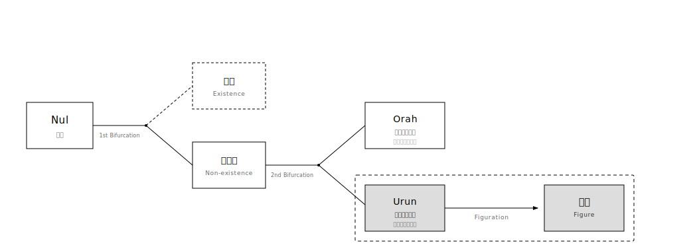

# ACREマニフェスト (ACRE Manifesto)

> "無限に作れる時代に、必然だけ残す。"
> "残すのは、接続の痕跡だけ。"

## 01. 背景 (Context)

ACREは、造形の成立条件を定義し直す。  
形が溢れ、造形が差分として消費される時代に、造形を **Urunへの接続が成立した痕跡**として扱う。  
それ以外は、形であっても接続ではない。

## 02. 基本原則 (Core Principles)

1. **無限差分への拒否**  
   無限に作れる時代に、差分を量産しない。

2. **代替の拒否**  
   アルゴリズム、価格、希少性、ステータスを、成立の代替にしない。  
   成立は外部評価で置き換えられない。

3. **痕跡主義**  
   接続が成立した痕跡だけを残す。  
   形は目的ではない。外在化は結果である。

## 03. 定義 (Definitions)

### Nul（ヌル）
分岐以前の未分化。存在／非存在がまだ分かれていない状態。

### Orah（オーラ）
外側の非存在。アクセス不可能領域として置かれる境界。

### Urun（ウルン）
内側の非存在。主体に沈む領域であり、接続の対象。

### Figuration（フィギュレーション／造形）
ACREにおけるFigurationは、Urun（内側の非存在）への接続が成立したときにだけ起こる外在化である。
差分を目的化せず、変奏が必要な場合も消費のためではなく、接続を別角度から照らして問いを残すために行う。
アルゴリズム、価格、希少性、ステータスは成立の代替にならない。
Figurationは形を増やす行為ではなく、痕跡を固定する行為である。

### Figure（フィギュア／造形物）
Figureは完成品ではない。接続が成立した痕跡として残る造形物である。
